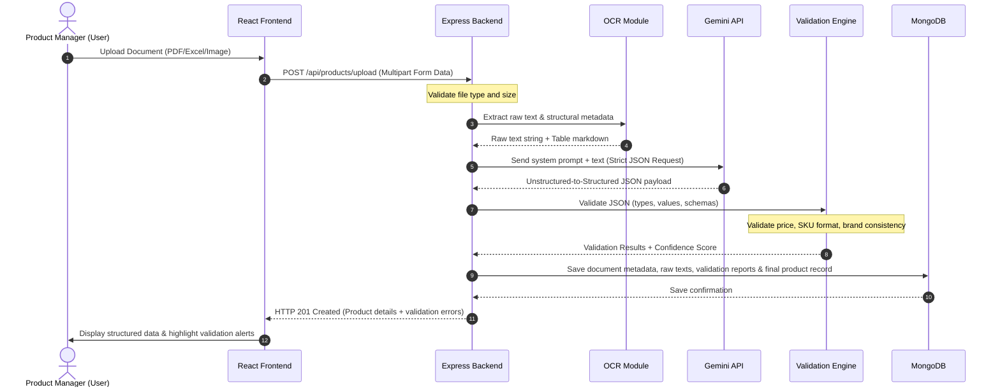

# Data Flow - Document Ingestion to Frontend Dashboard

This document details the lifecycle of data in the **AI-Powered Product Intelligence Platform**. It charts how a raw, unstructured product sheet is transformed into a structured, verified, and audited record stored in MongoDB and served on the dashboard.

---

## 1. End-to-End Data Flow Sequence

The diagram below tracks the sequence of operations for processing a product document.

---

## 2. Step-by-Step Data Lifecycles

### Step 1: User Uploads Document
* **Inputs**: Files (`.pdf`, `.png`, `.jpg`, `.xlsx`) representing product catalogues, invoices, or specifications.
* **Payload**: Form-data sent via HTTP POST to `/api/products/upload`.

### Step 2: Backend Ingestion
* **Process**: Checks file extension and size (e.g. limit to < 10MB).
* **Output**: Writes the file to a temporary uploads directory on the server disk or in memory.

### Step 3: OCR Extraction
* **Process**: Invokes parsing libraries depending on file type:
  * *PDFs*: `pdf-parse` or OCR.
  * *Images*: `tesseract.js` or Google Vision API.
  * *Excel*: `xlsx` library to parse tables into CSV/JSON format.
* **Output**: A clean, combined UTF-8 string containing all text and formatted tables.

### Step 4: Gemini Structuring
* **Process**: The backend formats a structured system prompt asking Gemini to extract details: Product Name, SKU, Description, Brand, Price, Currency, Dimensions, Specifications, and Compliance Flags.
* **Instruction**: The prompt forces Gemini to return a specific JSON schema (e.g. using Gemini's JSON Mode or structured outputs).
* **Output**: A raw JSON string containing key-value product data.

### Step 5: Validation Check
* **Process**: The backend's **Validation Engine** validates the Gemini result.
  > [!IMPORTANT]
  > Gemini's output must never be treated as correct by default.
* **Checks run**:
  1. *Data Integrity*: Ensure fields match target types (e.g., price is a positive number, Currency is standard 3-character ISO, SKU exists).
  2. *Business Rules*: Price range checks, brand whitelist matching, and missing field alerts.
* **Output**: A validation report structure detailing: `isValid` (boolean), list of `errors`, and list of `warnings`.

### Step 6: Confidence & Evidence Calculation
* **Process**: Calculates a confidence score based on structural checks:
  $$\text{Confidence Score (\%)} = \left( \frac{\text{Passed Rules}}{\text{Total Rules}} \right) \times 100$$
* **Evidence**: Stores references to where specific key items were found in the OCR raw text (e.g., if a SKU is found directly in the text, it has high evidence; if missing, it's flagged).
* **Output**: A metric card object (e.g. `score: 85`, `evidenceLevel: "High"`).

### Step 7: MongoDB Storage
* **Process**: Creates a document record containing:
  * Metadata (filename, upload date, file size).
  * Raw extraction logs (raw OCR output text, raw Gemini response).
  * Validation output (validation list, errors, confidence score).
  * Structured product data (the final corrected values).
* **State**: Record is set to `Needs Review` if validation errors occur, or `Verified` if all rules pass.

### Step 8: Backend Sends Result
* **Process**: Returns JSON response containing the newly created record ID, structured data, and validation errors.

### Step 9: Frontend Displays Result
* **Process**: Renders the product details on the dashboard. Fields with validation errors are marked in yellow/red alerts, allowing the user to inspect, modify, and manually approve the results.

---

## 3. Data Schema States Example

Below is a snapshot of the structured JSON data as it matures through the pipeline:

| Pipeline Stage | Data Representation Format / Sample Payload |
| :--- | :--- |
| **OCR Raw Text** | `"Invoice #1024 \n Date: 2026-08-01 \n Prod: Apex Drill (SKU-AP-99) \n Price: $250.00"` |
| **Gemini JSON Output** | `{"productName": "Apex Drill", "sku": "SKU-AP-99", "price": "250.00", "currency": "USD"}` |
| **Validation Report** | `{"isValid": true, "errors": [], "confidence": 100, "evidence": ["SKU found in text", "Price matched format"]}` |
| **Database Document** | Stores metadata, the raw text, the Gemini output, validation report, and final editable product record. |
