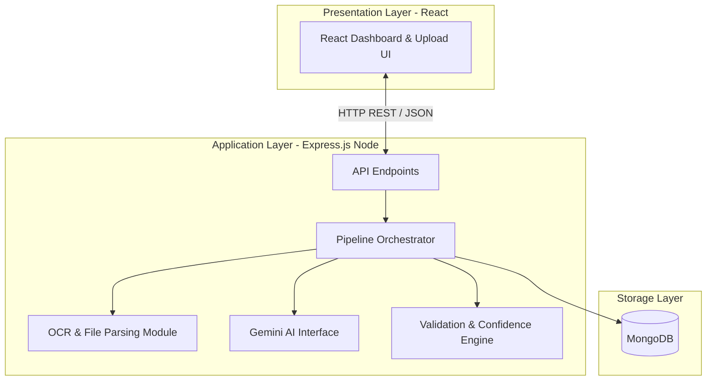

# System Architecture - AI-Powered Product Intelligence Platform

This document describes the high-level architecture, component responsibilities, and system design for the **AI-Powered Product Intelligence Platform**. To succeed in a 15-day hackathon, we prioritize a simple, reliable, single-instance backend (monolith) with clear module boundaries rather than complex microservices.

---

## 1. System Components

The system consists of three primary layers:
1. **Frontend Presentation Layer**: Built with React.js, displaying an interactive dashboard and document upload portal.
2. **Backend Application Layer**: An Express.js application acting as the orchestrator. It manages the document processing pipeline, interacts with MongoDB, handles security, and serves API requests.
3. **Database Layer**: MongoDB storing both structured product outputs and audit records (raw OCR output, Gemini raw JSON, and final validated status).

---

## 2. Component Overviews & Integration

### A. React Frontend Dashboard
* **Purpose**: Serves as the user interface for document uploads, processing visualization, validation review, and product inventory exploration.
* **Technology**: React.js, Tailwind CSS (or Vanilla CSS), and Axios for API communication.
* **Key Role**: Renders data-rich cards showing confidence indicators, validation warnings, and lists of structured product information.

### B. Node.js & Express.js Backend (The Orchestrator)
* **Purpose**: The central nervous system of the platform. It handles file ingestion, schedules sequential processing, executes validation logic, and reads/writes from the database.
* **Communication**: Receives HTTP POST requests (with multi-part form data for files) from the React frontend, and returns JSON payloads representing pipeline status and structured data.

### C. OCR & Document Processing Module
* **Purpose**: Parses uploaded files (PDFs, images, Excel catalogues) and extracts raw textual data.
* **Integration**: Lives as an internal module/library within the backend codebase. The backend calls it directly, sending the uploaded file path and receiving raw text/table structures in return.

### D. Gemini AI Interface
* **Purpose**: Interfaces with Google's Gemini API (e.g., `gemini-1.5-flash` or `gemini-2.0-flash` for fast, cost-effective extraction). It takes unstructured OCR text and structures it into a strict JSON format based on system prompts.
* **Integration**: Called via the official Google GenAI Node.js SDK on the backend.

### E. Validation & Confidence Engine
* **Purpose**: Critically inspects the JSON payload received from Gemini. It runs business-logic checks (e.g., matching prices, validating product SKUs, checking for missing required fields) and calculates a final reliability rating.
* **Integration**: Ingests Gemini outputs, computes validation scores, and appends a `confidence` object before database storage.

### F. MongoDB Database
* **Purpose**: Serves as the persistent data store.
* **Integration**: Accessed exclusively by the Backend Orchestrator using Mongoose or the MongoDB native driver. **The Frontend never directly communicates with MongoDB.**

---

## 3. Technology Touchpoints & Flows

### Where is OCR Used?
Immediately after file ingestion. When a user uploads a catalog PDF, scanned invoice image, or Excel sheet, the backend invokes the OCR / Parser module to convert the raw file into clean, readable text before sending anything to the AI.

### Where is Gemini Used?
After OCR text extraction. The raw unstructured text is wrapped in a structured prompt (system instructions + schema definition) and sent to Gemini to perform the cognitive translation from raw text to structured JSON keys.

### Where is Validation Used?
Immediately after Gemini returns its response. Because LLMs can hallucinate or output malformed data, the backend passes the Gemini output through a local validation engine to check data types, range boundaries, and logical consistency before saving.

### Where is MongoDB Used?
At the end of the processing pipeline (saving the validated state, raw OCR text, and AI output for auditing) and during API requests (reading files and product intelligence records for frontend rendering).

---

## 4. Error Handling Strategy

| Scenario | Impacted Component | Backend Handlers / Fallback Response |
| :--- | :--- | :--- |
| **Invalid Upload / Corrupt File** | Frontend / OCR | Reject request early with `400 Bad Request`. Clear temp storage. |
| **OCR Failure (No text found)** | OCR Module | Return `422 Unprocessable Entity` with a message: "Could not read text from document." |
| **Gemini Rate Limit / API Down** | Gemini SDK | Implement exponential backoff retry (up to 3 times). If it continues, fail gracefully, return `503 Service Unavailable`, and notify the user to retry. |
| **Malformed Gemini JSON** | Validation Engine | Attempt standard JSON parsing. If it fails, fallback to a regex repair, or flag the document as `Processing Failed` with validation status `JSON_PARSING_ERROR`. |
| **Failed Validations** | Validation Engine | Mark the document in MongoDB as `Needs Review` instead of failing the pipeline. Store validation errors so the frontend can highlight them for human-in-the-loop correction. |
| **Database Disconnection** | MongoDB | Express middleware logs the error, attempts database reconnection, and returns a `500 Internal Server Error` to the client. |

---

## 5. Security & Secrets Protection

* **Backend Environment Variables**: Store all sensitive keys (`GEMINI_API_KEY`, `MONGODB_URI`, `PORT`) in a `.env` file on the server.
* **Git Safety**: Add `.env` to `.gitignore` immediately to prevent keys from leaking into the shared GitHub repository.
* **Proxying API Keys**: The React frontend must *never* make direct API calls to Gemini. All AI interactions must flow through the backend server.
* **Input Sanitization**: File uploads are restricted by size (e.g., max 10MB) and MIME-type (only PDF, PNG, JPG, XLSX).

---

## 6. Deployment Plan (15-Day Hackathon Friendly)

To minimize deployment friction during the hackathon, we will use fully-managed cloud platforms that support quick setup:

1. **Frontend Deployment**:
   * **Host**: **Vercel** or **Netlify**.
   * **Mechanism**: Continuous deployment triggered by pushes to the `main` branch.
   * **Environment**: Configure `REACT_APP_API_URL` pointing to the deployed backend.

2. **Backend Deployment**:
   * **Host**: **Render** or **Railway**.
   * **Mechanism**: Deploy directly from the GitHub repository.
   * **Environment**: Set up environment variables (`GEMINI_API_KEY`, `MONGODB_URI`) directly in the Render/Railway service dashboard.

3. **Database**:
   * **Host**: **MongoDB Atlas** (Free Tier).
   * **Security**: Whitelist all IP addresses (`0.0.0.0/0`) during the hackathon to avoid routing blockages on dynamic host environments like Render.
