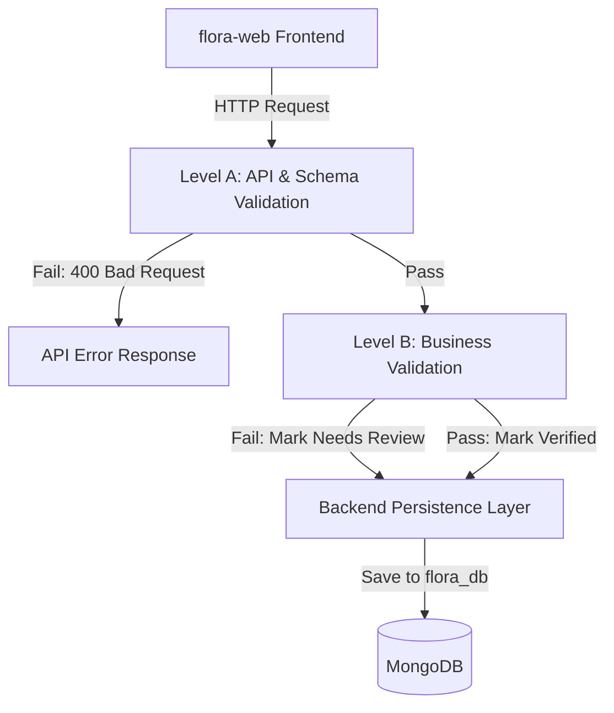

# API and Service Contracts | Flora – AI Powered Product Intelligence Platform

This document defines the interface boundaries, canonical data models, validation requirements, and error structures for **Flora – AI Powered Product Intelligence Platform**. These contracts ensure clear division of labor and seamless integration across the 4-person team during the 15-day hackathon.

## Project Identifiers
* **Frontend**: `flora-web` (React.js application)
* **Backend**: `flora-server` (Express.js application)
* **Database**: `flora_db` (MongoDB database)
* **API Prefix**: `/api/v1/`
* **Repository**: `flora-ai-platform`

---

## 1. Assumptions & Integration Guidelines

Before defining the contracts, the following integration guidelines and project-scoped assumptions have been established:

1. **OCR Module Deployment & Ownership**:
   * Deployment: The OCR and file parsing module is an **internal module** of `flora-server` at the deployment level. It is not deployed as a separate microservice.
   * Team Ownership: The module is owned and implemented by the **OCR Engineer** at the team level.
2. **Configurable Gemini Model**:
   * The Gemini model version (e.g., `gemini-1.5-flash` or `gemini-2.0-flash`) is not hardcoded. It is fully configurable through backend environment variables (`GEMINI_MODEL`) or configuration files.
3. **No Regex-Based JSON Repair**:
   * To prevent unpredictable parsing behavior, the pipeline does not attempt regex-based repair of malformed Gemini JSON responses.
   * The pipeline strictly executes: **Gemini → structured response → JSON parsing → schema validation → business validation → persistence**.
   * If Gemini returns malformed output, the backend will reject the output. A bounded retry may be performed by the Gemini service. If the response remains invalid after retries, the operation fails according to the defined error contracts.
4. **Validation/Database Separation**:
   * The Validation Engine is decoupled from the database. It does not directly persist records to MongoDB.
   * The flow is: **Gemini → Validation Engine → Validation Result → Backend Persistence Layer → MongoDB (`flora_db`)**.
   * This separation allows the Validation Engine to remain independently testable without database dependencies.
5. **Brand Whitelist Configuration**:
   * Brand whitelists are configurable and defined based on actual Flora business and project requirements, rather than hardcoded static arrays.

---

## 2. Validation Flow (Two Levels of Validation)

Flora applies two distinct levels of validation to protect backend integrity and ensure business rule compliance:



### A. API / Schema Validation
* **Purpose**: Protects `flora-server` from malformed requests, buffer overflows, and incorrect payload types.
* **Scope**: Performed on the incoming HTTP request. Checks body format, file size limits (max 10MB), permitted MIME types, and basic request data types.
* **Failure Handling**: Immediate termination of the request, returning an HTTP `400 Bad Request` with standard error response code.

### B. Business Validation
* **Purpose**: Applies Flora product domain rules.
* **Scope**: Evaluates canonical product fields against configured business constraints (e.g., price positivity checks, configurable brand whitelist matching, SKU structural verification).
* **Failure Handling**: Does not reject the persistence flow. If business validation fails, the validation errors and warnings are recorded, and the document is saved with a status of `Needs Review`.

---

## 3. Canonical Product vs. Database Record

To keep the platform modular, we distinguish the representation of the product data itself from the metadata needed to audit and trace the ingestion pipeline.

### A. Canonical Product Object
This object represents the structured product information extracted from a document.

| Field Name | Type | Required | Description | Validation Constraints |
| :--- | :--- | :---: | :--- | :--- |
| `productName` | String | Yes | Identified name of the product | Cannot be empty. Truncated if length > 255. |
| `sku` | String | Yes | Stock Keeping Unit / Part Number | String format. Must match regex pattern `/^[A-Z0-9\-_]{3,50}$/i` (letters, numbers, dashes, underscores). |
| `description` | String | No | Short textual description of the product | Default to empty string if missing in text. |
| `brand` | String | Yes | Brand or manufacturer of the product | Must match values in the configurable Brand Whitelist. |
| `price` | Number | Yes | Price of the product | Must be a positive decimal number (`price > 0.0`). |
| `currency` | String | Yes | 3-letter currency code (ISO 4217) | Must be exactly 3 uppercase letters (e.g., `USD`, `EUR`). |
| `dimensions` | String | No | Physical dimensions (length x width x height) | Normalized string representation. |
| `specifications`| Object | No | Technical specifications | Object containing flat string key-value pairs. |
| `complianceFlags`| Array[String] | No | Certifications and safety standard flags | List of standard flags (e.g., `["CE", "RoHS", "UL"]`). |

#### Canonical Product JSON Example
```json
{
  "productName": "Flora E-Grow Light",
  "sku": "FLORA-EGL-400W",
  "description": "Smart LED grow light with spectrum control.",
  "brand": "FloraGrow",
  "price": 189.99,
  "currency": "USD",
  "dimensions": "45 x 30 x 10 cm",
  "specifications": {
    "wattage": "400W",
    "spectrum": "Full Spectrum",
    "weight": "3.5 kg"
  },
  "complianceFlags": ["CE", "RoHS"]
}
```

### B. MongoDB Processing Record Document
This is the full persistent wrapper stored in `flora_db`. It tracks ingestion history, raw output data, and validation results alongside the canonical product data.

| Field Name | Type | Description |
| :--- | :--- | :--- |
| `_id` | ObjectId | MongoDB unique identifier. |
| `metadata` | Object | Upload details: `filename` (String), `fileSize` (Number, bytes), `uploadDate` (Date). |
| `status` | String | Processing status: `"Verified"`, `"Needs Review"`, or `"Processing Failed"`. |
| `rawOcrText` | String | Raw text extracted from the document by the OCR Module. |
| `rawGeminiResponse` | String | The raw JSON string response returned by the Gemini AI API (preserved for audits). |
| `validationReport` | Object | The results generated by the Validation Engine (described in Boundary 4). |
| `productData` | Object | The Canonical Product Object (as defined above). |
| `processingError` | String | Optional error identifier if status is `"Processing Failed"`. |
| `createdAt` / `updatedAt`| Date | System auto-generated timestamps. |

---

## 4. Consistent API Error Structure

All endpoints under the `/api/v1/` prefix return a standard JSON error response for non-2xx status codes.

### Error Schema Fields
* `success` (Boolean, Required): Always `false`.
* `error` (Object, Required): Contains error details.
  * `code` (String, Required): Machine-readable error code.
  * `message` (String, Required): Human-readable error message.
  * `details` (Object/Array, Optional): Context-specific error data.

### API Error Example
```json
{
  "success": false,
  "error": {
    "code": "INVALID_FILE_UPLOAD",
    "message": "The uploaded file exceeds the maximum permitted size of 10MB.",
    "details": {
      "uploadedSize": 12582912,
      "maxSize": 10485760
    }
  }
}
```

---

## 5. Boundary Contracts

### Boundary 1: Frontend (flora-web) ↔ Backend (flora-server)

* **Purpose**: Serves as the REST API contract for uploading catalogues, loading inventory, highlighting validation states, and committing manual overrides.
* **Caller**: React Frontend (`flora-web`)
* **Receiver**: Express.js Backend (`flora-server`)

---

#### 1. Ingest Product Document
* **Endpoint**: `POST /api/v1/products/upload`
* **Request Format**: `multipart/form-data`
* **API/Schema Validation**: Enforces binary file input under key `file`, file size < 10MB, and valid extensions (`.pdf`, `.png`, `.jpg`, `.jpeg`, `.xlsx`).
* **Response (Success - 201 Created)**: Returns the populated MongoDB processing record layout.
* **Response Payload Example**:
  ```json
  {
    "success": true,
    "data": {
      "_id": "64d2b2745cf84f3e30d17208",
      "metadata": {
        "filename": "flora_grow_catalog.pdf",
        "fileSize": 350100,
        "uploadDate": "2026-08-09T01:48:00.000Z"
      },
      "status": "Needs Review",
      "validationReport": {
        "isValid": false,
        "errors": [
          {
            "field": "price",
            "message": "Price must be a positive decimal number",
            "value": -5.0
          }
        ],
        "warnings": [
          {
            "field": "brand",
            "message": "Brand 'FloraX' is not in the whitelist.",
            "value": "FloraX"
          }
        ],
        "confidence": {
          "score": 0.85,
          "basis": "Gemini content extraction accuracy metadata"
        }
      },
      "productData": {
        "productName": "Flora Grow Tent",
        "sku": "FLORA-GT-100",
        "description": "Premium canvas grow tent",
        "brand": "FloraX",
        "price": -5.0,
        "currency": "USD",
        "dimensions": "100 x 100 x 200 cm",
        "specifications": {},
        "complianceFlags": []
      }
    }
  }
  ```

---

#### 2. Get All Products
* **Endpoint**: `GET /api/v1/products`
* **Query Parameters (Optional)**:
  * `status`: Filters by `"Needs Review"`, `"Verified"`, or `"Processing Failed"`.
  * `brand`: Filters by brand name.
  * `search`: Searches across `productName` and `sku`.
* **Response (Success - 200 OK)**: Returns an array of matching MongoDB processing record documents.

---

#### 3. Get Product by ID
* **Endpoint**: `GET /api/v1/products/:id`
* **Response (Success - 200 OK)**: Returns the single matching MongoDB processing record.

---

#### 4. Update Product (Manual Override)
* **Endpoint**: `PUT /api/v1/products/:id`
* **Request Format**: `application/json`
* **Request Body**: The corrected Canonical Product Object.
* **API/Schema Validation**: Validates fields against basic schema constraints (e.g. correct types).
* **Business Validation**: Re-runs business rules. If all rules are satisfied, the backend updates status to `"Verified"`.
* **Response (Success - 200 OK)**: Returns the updated MongoDB processing record.

---

#### 5. Delete Product
* **Endpoint**: `DELETE /api/v1/products/:id`
* **Response (Success - 200 OK)**:
  ```json
  {
    "success": true,
    "message": "Product successfully deleted."
  }
  ```

* **Ownership**: **Backend Engineer** owns the API route orchestration, middleware schema validators, and data retrieval logic. **Frontend Engineer** owns form submission, query params, dashboard state, and rendering UI warnings.

---

### Boundary 2: Backend Orchestrator ↔ OCR Module

* **Purpose**: Pass file paths to the OCR module and retrieve normalized raw text and markdown tables.
* **Caller**: Backend Orchestrator (`flora-server` core controller)
* **Receiver**: OCR & Document Processing Module (Internal helper in `flora-server`)
* **Interface**: Node.js Internal JavaScript Function Contract

#### Function Signature
```javascript
/**
 * Parses uploaded documents and extracts text and formatted tables.
 * @param {string} filePath - Absolute path to the temporarily uploaded file on disk.
 * @param {string} mimeType - The MIME type of the uploaded file.
 * @returns {Promise<OcrResult>} Resolves with clean text, table data, and metadata.
 */
async function parseDocument(filePath, mimeType) { ... }
```

#### Request/Input Parameters
* `filePath` (String, Required): Path to the temp uploaded file on disk.
* `mimeType` (String, Required): Validated request mime-type.

#### Response/Output (`OcrResult` Object)
* `success` (Boolean): `true` if text extraction succeeded.
* `rawText` (String): Normalized UTF-8 text contents of the document.
* `tableMarkdown` (String): Normalized markdown representation of spreadsheet sheets or tabular PDF sections.
* `metadata` (Object): Document metadata (page count, etc.).

* **Ownership**: **OCR Engineer** is responsible for implementing document parsing logic and normalizing output to UTF-8. **Backend Engineer** calls the module inside the ingestion pipeline.

---

### Boundary 3: Backend Orchestrator ↔ Gemini AI API

* **Purpose**: Send prompt payloads to Google's Gemini API and receive structured JSON responses.
* **Caller**: Backend Gemini Service (`flora-server`)
* **Receiver**: Google Gemini API (via Node.js SDK)
* **Interface**: HTTPS SDK Request/Response Contract

#### Request Configuration
The Gemini model version and temperature are configurable:
* `model`: Configured via environment variable `GEMINI_MODEL` (e.g. `"gemini-1.5-flash"`).
* `responseMimeType`: `"application/json"` (forces structured JSON responses).
* `temperature`: Low value (e.g., `0.1`) configured via environment config to ensure deterministic extractions.
* `contents`: System prompts defining extraction rules and schema constraints, alongside `rawText` and `tableMarkdown` inputs.

#### Error Handling & Bounded Retry
If Gemini API encounters transient network errors, rate limits (HTTP 429), or outputs malformed text that cannot be parsed as JSON:
1. The Gemini service within `flora-server` executes a bounded retry (max 3 attempts).
2. If all retries fail or continue returning invalid format, the operation fails, and status is marked as `"Processing Failed"` with error code `AI_PROVIDER_UNAVAILABLE` or `JSON_PARSING_ERROR`.

* **Ownership**: **Team Leader** designs the prompts, configures environment parameters, manages SDK integrations, and implements the bounded retry policy.

---

### Boundary 4: Gemini AI (Untrusted) ↔ Validation Engine

* **Purpose**: The Validation Engine processes untrusted JSON strings returned by Gemini, parses them, executes business checks, and reports failures.
* **Caller**: Backend Orchestrator (`flora-server` controller)
* **Receiver**: Validation Engine (Independent module in `flora-server`)
* **Interface**: JavaScript Function Contract (decoupled from MongoDB)

#### Flow & Validation Scope
1. **JSON Parsing**: Attempts to parse the raw Gemini JSON text. If it fails, rejects immediately (fails pipeline; no regex repair is attempted).
2. **Schema & Business Validation**:
   * API/Schema validation: Ensures required fields (`productName`, `sku`, `brand`, `price`, `currency`) exist and conform to basic types.
   * Business validation: Matches `brand` against the configurable brand whitelist. Verifies `price` is positive. Validates SKU shape.
3. **Extraction Confidence**: If the Gemini API returns specific metadata-based confidence scores (e.g., token probability scores), they are mapped to the validation result. Validation correctness (`isValid`) is calculated independently of this confidence rating.

#### Validation Output Structure
```javascript
{
  isValid: false, // true if errors array is empty
  cleanedData: { ... }, // Conforms to Canonical Product Object schema
  errors: [
    {
      field: "price",
      message: "Price must be a positive decimal number",
      value: -5.0
    }
  ],
  warnings: [
    {
      field: "brand",
      message: "Brand 'FloraX' is not in the whitelist.",
      value: "FloraX"
    }
  ],
  confidence: {
    score: 0.85, // Included only if there is a defensible basis (e.g., Gemini metadata metrics)
    basis: "Gemini content extraction accuracy metadata"
  }
}
```

* **Ownership**: **Team Leader** defines the validation schemas, business logic checkers, and confidence metadata mapping.

---

### Boundary 5: Validation Result ↔ MongoDB

* **Purpose**: Persist processing audits, reports, and product records to `flora_db`.
* **Caller**: Backend Persistence Layer (`flora-server`)
* **Receiver**: MongoDB database (`flora_db`)
* **Interface**: Mongoose Model Persistence Call

#### Ingestion flow details
The backend persistence layer takes the metadata, `rawOcrText`, `rawGeminiResponse`, the `Validation Result` object from Boundary 4, and persists them into the MongoDB processing record structure:
1. Status is computed based on validation results:
   * If `isValid === true`, status is set to `"Verified"`.
   * If `isValid === false`, status is set to `"Needs Review"`.
   * If JSON parsing failed completely, status is set to `"Processing Failed"`.
2. Mongoose models structure the data strictly before calling `.save()` on `flora_db`.

* **Ownership**: **Team Leader** defines the Mongoose schemas and database models. **Backend Engineer** integrates database queries and handles connection pooling.

---

## Contract Revision Notes

The following architectural corrections were applied to this contract:
1. **Project Identifiers and Naming**: Updated all project names and directories to use **Flora – AI Powered Product Intelligence Platform** consistently. Identified `flora-web` (Frontend), `flora-server` (Backend), `flora_db` (Database), `/api/v1/` (API prefix), and `flora-ai-platform` (Repository).
2. **API Versioning**: Modified all REST endpoints to use the official `/api/v1/` API prefix.
3. **Configurable Brand Whitelist**: Removed the static example brands. Described the brand whitelist validation as configurable and based on dynamic Flora business requirements.
4. **No Regex JSON Repairs**: Removed references to regex-based JSON repairs. Malformed JSON output is now rejected, with an optional bounded retry at the Gemini service level before returning a standard processing failure error.
5. **Validation/Database Separation**: Explicitly decoupled the Validation Engine from MongoDB. The engine now takes the raw Gemini text, produces an in-memory Validation Result, and returns it to the Backend Persistence Layer to handle MongoDB writes.
6. **OCR Deployment Clarification**: Confirmed that the OCR module is not a standalone microservice; it is an internal deployment module of `flora-server` owned and implemented by the team's OCR Engineer.
7. **Gemini Model Config**: Removed the hardcoded version of the Gemini model. Changed model and temperature configuration to load from backend environment variables/configuration.
8. **Confidence Score Calculation**: Removed the arbitrary passed/total validation rules formula. Decoupled validation correctness (`isValid`) from confidence metrics and clarified that confidence must be based on a defensible source (e.g. Gemini API token metadata).
9. **Two Levels of Validation**: Structured and explained the two validation layers: Level A (API/Schema Validation) and Level B (Business Validation) and how they flow sequentially.
10. **Canonical Product vs. DB Processing Document**: Separated the definition of the product domain object (Canonical Product Object) from the tracing envelope (MongoDB Processing Record Document).
11. **rawGeminiResponse Concept**: Formally designated `rawGeminiResponse` to represent the untrusted provider audit output, separating it from the final parsed and validated product data.
